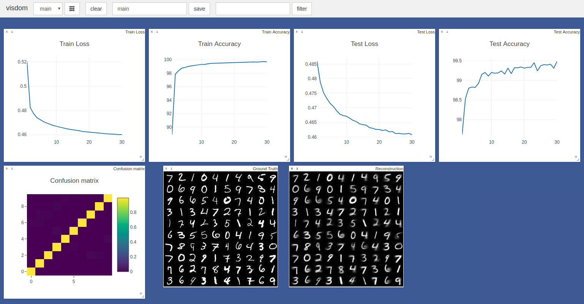

# Dynamic Routing Between Capsules

A barebones CUDA-enabled PyTorch implementation of the CapsNet architecture in the paper "Dynamic Routing Between Capsules" by [Kenta Iwasaki](https://github.com/iwasaki-kenta) on behalf of Gram.AI.

Training for the model is done using [TorchNet](https://github.com/pytorch/tnt), with MNIST dataset loading and preprocessing done with [TorchVision](https://github.com/pytorch/vision).

## Description

> A capsule is a group of neurons whose activity vector represents the instantiation parameters of a specific type of entity such as an object or object part. We use the length of the activity vector to represent the probability that the entity exists and its orientation to represent the instantiation paramters. Active capsules at one level make predictions, via transformation matrices, for the instantiation parameters of higher-level capsules. When multiple predictions agree, a higher level capsule becomes active. We show that a discrimininatively trained, multi-layer capsule system achieves state-of-the-art performance on MNIST and is considerably better than a convolutional net at recognizing highly overlapping digits. To achieve these results we use an iterative routing-by-agreement mechanism: A lower-level capsule prefers to send its output to higher level capsules whose activity vectors have a big scalar product with the prediction coming from the lower-level capsule.

Paper written by Sara Sabour, Nicholas Frosst, and Geoffrey E. Hinton. For more information, please check out the paper [here](https://arxiv.org/abs/1710.09829).

## Requirements

* Python 3
* PyTorch
* TorchVision
* TorchNet
* TQDM
* Visdom

## Usage

**Step 1** Adjust the number of training epochs, batch sizes, etc. inside `capsule_network.py`.

```python
BATCH_SIZE = 100
NUM_CLASSES = 10
NUM_EPOCHS = 30
NUM_ROUTING_ITERATIONS = 3
```

**Step 2** Start training. The MNIST dataset will be downloaded if you do not already have it in the same directory the script is run in. Make sure to have Visdom Server running!

```console
$ sudo python3 -m visdom.server & python3 capsule_network.py
```

## Benchmarks

Highest accuracy was 99.7% on the 443rd epoch. The model may achieve a higher accuracy as shown by the trend of the test accuracy/loss graphs below.



Default PyTorch Adam optimizer hyperparameters were used with no learning rate scheduling. 
Epochs with batch size of 100 takes ~3 minutes on a Razer Blade w/ GTX 1050 and ~2 minutes on a NVIDIA Titan XP

## TODO

* Extension to other datasets apart from MNIST.

## Credits

Primarily referenced these two TensorFlow and Keras implementations:
1. [Keras implementation by @XifengGuo](https://github.com/XifengGuo/CapsNet-Keras)
2. [TensorFlow implementation by @naturomics](https://github.com/naturomics/CapsNet-Tensorflow)

Many thanks to [@InnerPeace-Wu](https://github.com/InnerPeace-Wu) for a [discussion on the dynamic routing procedure](https://github.com/XifengGuo/CapsNet-Keras/issues/1) outlined in the paper.

## Contact/Support

Gram.AI is currently heavily developing a wide number of AI models to be either open-sourced or released for free to the community, hence why we cannot guarantee complete support for this work.

If any issues come up with the usage of this implementation however, or if you would like to contribute in any way, please feel free to send an e-mail to [kenta@perlin.net](kenta@perlin.net) or open a new GitHub issue on this repository.
